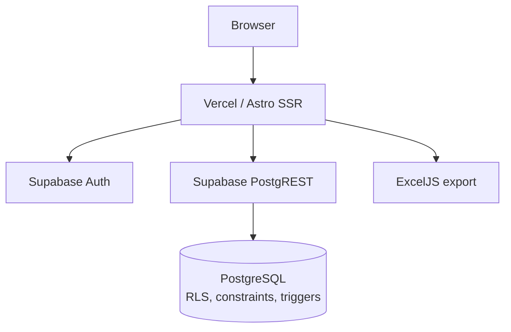

# Daily Production and Maintenance Reporting Platform

## Overview

This application digitizes daily production and maintenance reporting for a manufacturing and packing operation. It centralizes machine-level production records, downtime events, controlled report finalization, operational dashboards, and administrative catalogs in a Spanish-language interface.

## Core Capabilities

- Machine-specific production reports with autosave and controlled submission or cancellation.
- Downtime tracking by category with START/STOP workflows and overlap prevention.
- Role-specific dashboards and report visibility.
- Administration of users, assignments, machines, and operational catalogs.
- Server-generated Excel workbooks for authorized reporting and analysis.
- Layered role-based access through application checks, Supabase Auth, RLS, grants, constraints, and triggers.

## Roles

| Role | Primary capabilities |
| --- | --- |
| Administrator | Reviews all reports, manages users and catalogs, performs supported report corrections, and exports data. |
| Operator | Creates and edits assigned-machine drafts, records downtime, and submits or cancels owned reports. |
| Viewer | Reads submitted reports and exports the data visible through RLS. |

## Architecture



## Engineering Highlights

- Astro server-side rendering with selective React islands.
- Cookie-backed Supabase Auth sessions and RLS-constrained data access.
- Database-enforced report workflow and operator assignment rules.
- Normalized, case-insensitive catalog uniqueness that includes inactive records.
- Immutable yearly report folios and historical creator identity snapshots.
- Database prevention of simultaneous open or overlapping downtime events.
- Server-side Excel generation using the authoritative metrics view.
- A server-only service-role client with narrow database grants.
- pgTAP coverage for critical database constraints and workflows.

## Technology Stack

| Area | Technology |
| --- | --- |
| Web application | Astro 7, server output |
| Interactive UI | React 19 islands |
| Styling | Tailwind CSS 4 |
| Data and identity | Supabase PostgreSQL, Auth, PostgREST, and RLS |
| Spreadsheet export | ExcelJS 4 |
| Runtime and package manager | Bun 1.3 |
| Deployment adapter | Astro Vercel adapter |

## Security Model

Authorization is layered across server-rendered UI, middleware and API role checks, RLS and explicit grants, and database constraints and triggers. Browser UI restrictions are a convenience rather than the security boundary. The service-role key is restricted to server-side administrative operations. See [Security and Abuse Controls](docs/SECURITY_AND_ABUSE.md).

## Local Development

```sh
bun install
bun run db:start
bunx supabase status
bun run dev
```

The local Supabase seed creates role-specific demonstration accounts for isolated development. Review or replace the local-only credentials in `supabase/seed.sql` before starting the stack. Never reuse these credentials in Supabase Cloud or shared environments.

## Tests

The repository includes pgTAP database tests for critical constraints, cancellation behavior, catalog uniqueness, and final demonstration readiness.

```sh
bun run db:test
```

Build validation is also expected before delivery:

```sh
bun run build
```

## Build

```sh
bun run build
```

## Environment Variables

| Variable | Exposure |
| --- | --- |
| `PUBLIC_SUPABASE_URL` | Public application configuration |
| `PUBLIC_SUPABASE_PUBLISHABLE_KEY` | Public Supabase publishable key |
| `SUPABASE_SERVICE_ROLE_KEY` | Server only; never expose to the browser |

Do not commit environment values or production credentials.

## Documentation

- [API Reference](docs/API.md)
- [Architecture](docs/ARCHITECTURE.md)
- [Data Model](docs/DATA_MODEL.md)
- [Manual de Usuario](docs/USER_GUIDE.md)
- [Manual de Administración](docs/ADMIN_GUIDE.md)
- [Uso Permitido, Restricciones y Controles de Seguridad](docs/SECURITY_AND_ABUSE.md)
- [Deployment Guide](docs/DEPLOYMENT.md)
