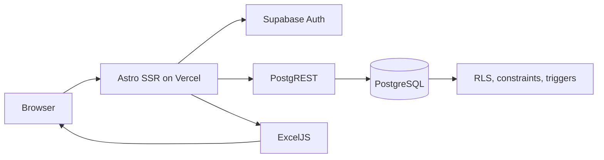
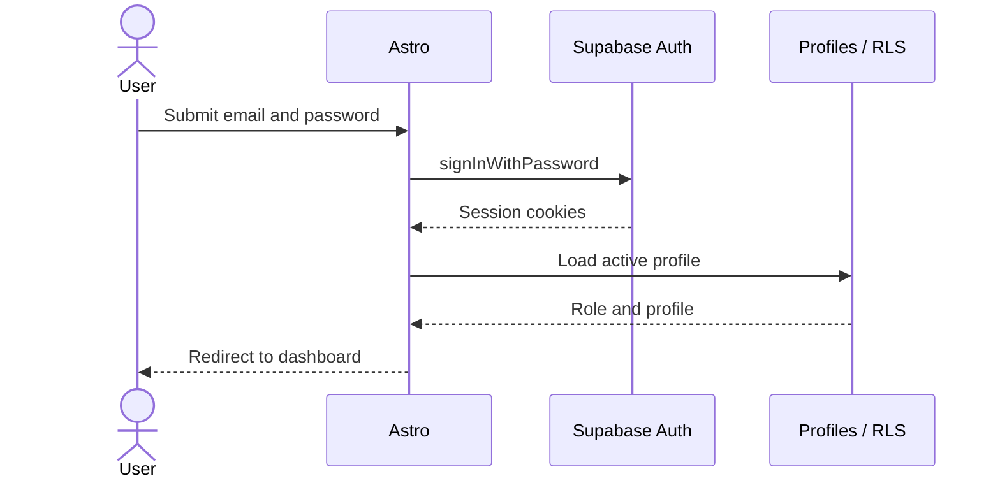
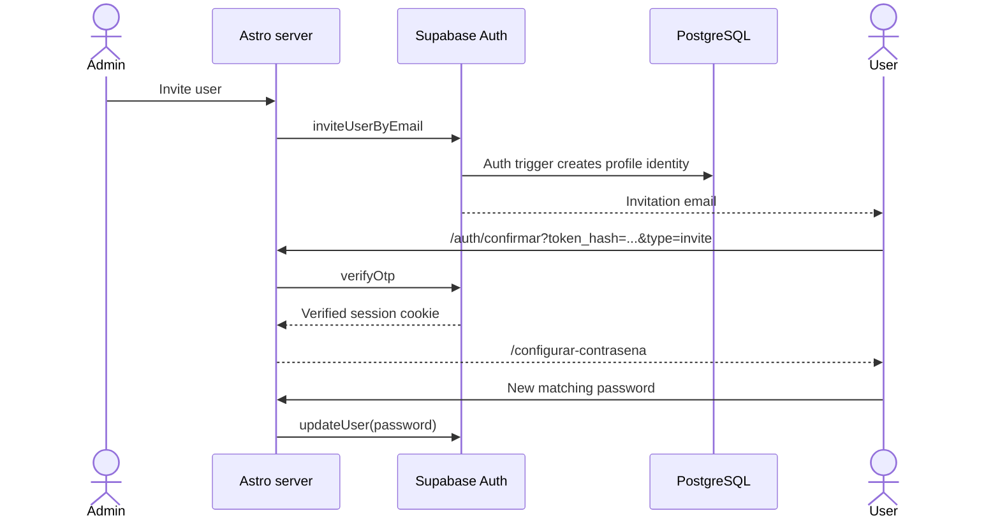
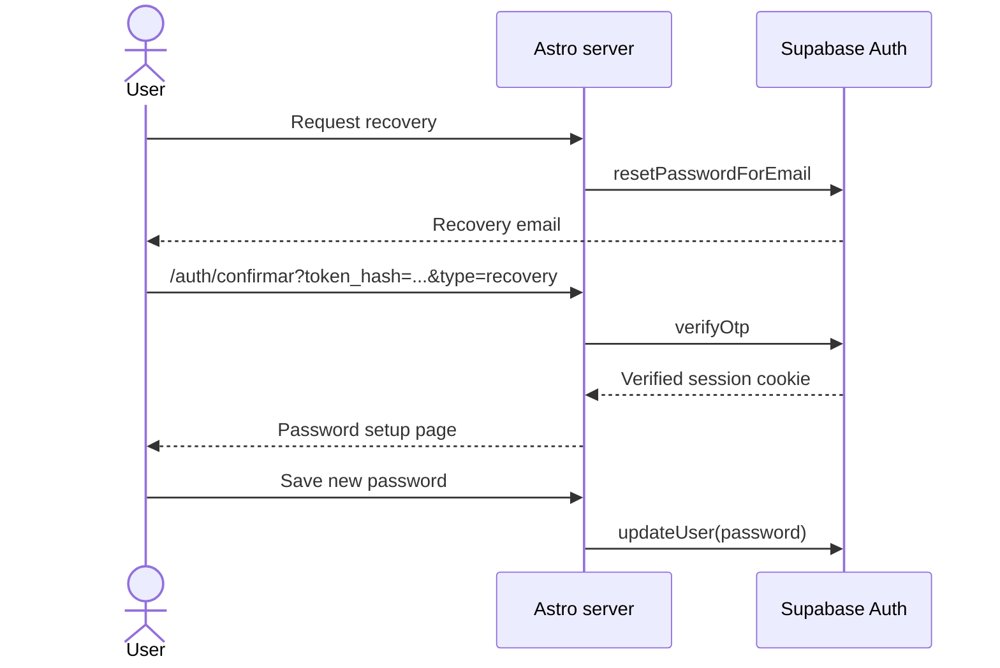
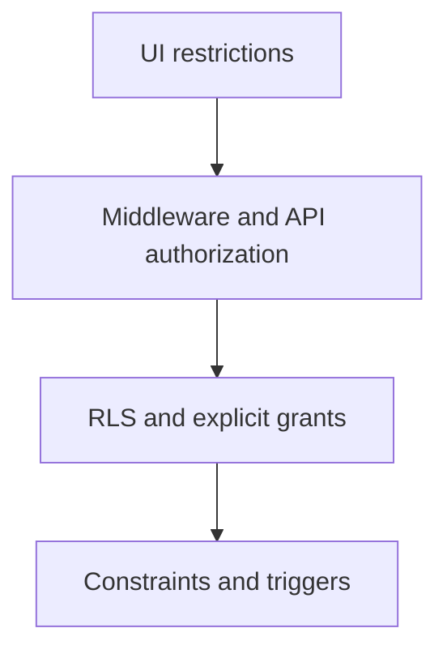
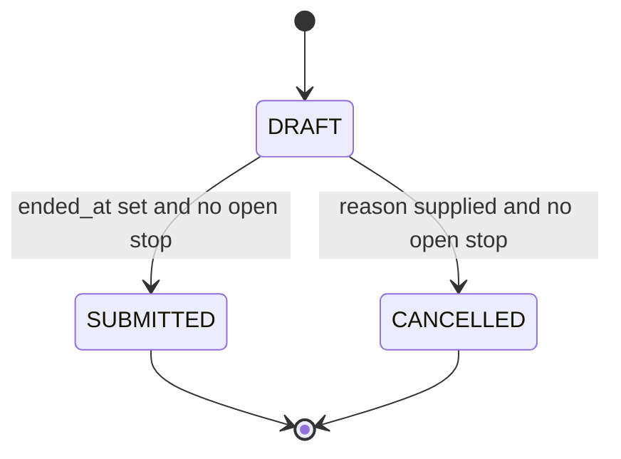
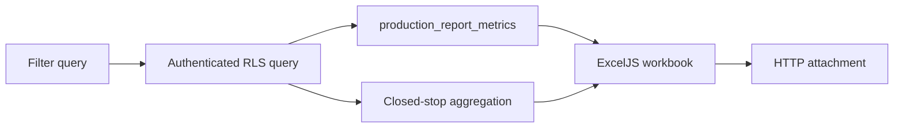

# Architecture

## System Overview

The application is an Astro 7 server-rendered application configured with the Vercel adapter. Supabase provides Auth, PostgREST, PostgreSQL, RLS, constraints, and triggers. React 19 is reserved for interactive islands. ExcelJS generates reporting workbooks on the server.

## Rendering Model

Astro pages authenticate and load data on the server, then send rendered HTML. Interactive report editing uses React islands for components such as the report editor, stop manager, sortable stop table, and React-backed modal behavior. Administration largely uses Astro components, native forms, and small page-local scripts. This keeps client-side state focused on workflows that need it.

The user interface is Spanish and uses `es-CO` formatting. Operational date and time presentation uses `America/Bogota`.

## Supabase Client Types

### Authenticated SSR client

The regular server client reads and writes Supabase session cookies. It calls Auth as the current user and sends that session to PostgREST, so database operations are constrained by RLS. This client powers normal pages, report workflows, dashboards, and authorized exports.

### Server admin client

The server-only admin client uses the service-role key for Supabase Auth Admin operations required by user administration. Its direct database privileges are deliberately narrow: schema usage; profile read/update; machine read; assignment CRUD; administrative audit insert; and audit sequence usage. The key is not browser-accessible and is not a substitute for the normal user client.

## Authentication Lifecycle

### Login

`getAuthContext` validates the Auth user and then loads the application profile. An inactive profile is rejected even if an Auth session exists.

### Invitation and password setup

### Recovery

The recovery request always gives a neutral response and does not disclose account existence.

### Retirement and reactivation

Retirement keeps the same Auth/profile UUID and historical references. The server applies a long Auth ban, deactivates assignments, marks the profile inactive with removal metadata, and writes `REMOVE_USER` to the administrative audit log. Reactivation loads that same Auth identity, removes the ban, deactivates existing assignments, activates only explicitly selected active machines for an operator, clears removal metadata, and records `REACTIVATE_USER`. Compensation attempts restore prior state if a later database step fails.

## Authorization Layers

UI visibility improves usability but is not the primary security boundary. Middleware and endpoints establish authentication and role requirements. RLS controls row visibility and mutation rights for the current session. Grants limit direct object access, while constraints and triggers preserve invariants even when requests race.

## Report Lifecycle

Only operators create reports. A draft requires an active, assigned machine; one draft is allowed per machine and an operator may hold at most five. The responsible operator can edit, record stops, submit, or cancel an owned draft. Submission requires an end time and no open stop. Cancellation requires a reason and no open stop. Finalized reports have no further normal status transition; only supported administrator corrections are available.

## Excel Generation Flow

Exports use the authenticated SSR client, so Viewer visibility remains limited to submitted reports. The authoritative metrics view supplies production calculations. Open stops appear in detail but do not contribute provisional duration to totals or category columns.

## PWA and Connectivity Foundation

The browser registers a native root-scoped service worker. Network responses remain authoritative for all SSR documents, authentication, APIs, reports, catalogs, administration, and exports. The worker caches only the static offline fallback, declared icons, manifest, and content-hashed `/_astro/` assets; authenticated HTML is never stored in Cache Storage.

Browser connectivity events are combined with a lightweight same-origin `HEAD /api/health` probe. A shared client controller powers the global connection banner and guards both React mutations and native POST forms. It does not persist operations or replay requests. See [PWA y base de funcionamiento sin conexión](PWA_OFFLINE.md).
