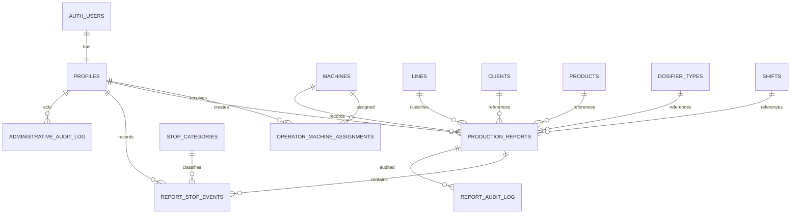

# Data Model

## Core Relationships



The diagram intentionally shows only the application’s principal relationships rather than every column and audit reference.

## Application Objects

### `profiles`

Application identity and authorization profile. Its UUID primary key references the Supabase Auth user and therefore preserves a single identity across invitation, retirement, and reactivation. Important fields include full name, job title, role, active state, and retirement metadata (`removed_at`, `removed_by`). Profile full names are not unique; email identity belongs to Supabase Auth.

### `machines`

Machine catalog with UUID primary key, code, name, description, and active state. Reports and operator assignments reference machines.

### `operator_machine_assignments`

Links operators to permitted machines using the composite primary key `(operator_id, machine_id)`. Assignment rows carry active state. Reactivation does not automatically restore old active assignments.

### Catalogs

`lines`, `clients`, `products`, `dosifier_types`, `shifts`, and `stop_categories` use UUID primary keys and active state. They classify report data or downtime. Stop categories additionally have a numeric code used by the export’s `P-{code}` columns.

### `production_reports`

The central report table uses a UUID primary key. It references its creator, machine, and optional operational catalogs. Important state fields include `status` (`DRAFT`, `SUBMITTED`, or `CANCELLED`), production timing and values, submission metadata, cancellation reason/metadata, and supported administrative-correction metadata. The table also stores its folio and historical snapshots.

### `report_stop_events`

Downtime events use UUID primary keys and reference a report, stop category, and responsible profile. Start/end timestamps, duration, description, and open/closed state support downtime tracking. An open event has no closed duration.

### `report_audit_log`

Stores field-level old/new values, actor, and time for supported administrator changes to finalized reports. It is distinct from the administration audit log.

### `administrative_audit_log`

Stores selected administrative actions with actor and time. Current writes cover successful catalog deletion plus user retirement and reactivation; it is not a comprehensive event ledger.

### `production_report_metrics`

A `security_invoker` view that provides the authoritative derived production and downtime metrics while preserving the caller’s RLS context.

### `report_folio_counters`

Maintains the yearly sequence used to assign report folios. Its primary key is the year.

## Report Identity and Snapshots

Report folios have the immutable form `RPT-YYYY-NNNNNN`. The year comes from `report_date` when available, otherwise the database current date, and a yearly counter supplies the sequence.

Creator identity is copied into immutable full-name, job-title, and role snapshot fields. Client and product names are also stored as report snapshots so later catalog changes do not rewrite those historical labels. Other catalog relationships should not be assumed to be snapshots: the schema retains their current foreign-key relationships.

## Catalog Integrity

Catalog uniqueness is based on:

```sql
lower(btrim(value))
```

This ignores leading and trailing whitespace and letter casing, preserves internal whitespace, and preserves accents. Inactive rows remain included, so deactivation does not free a code or name for reuse.

Normalized uniqueness applies to machine, product, client, line, and dosifier type codes and names; non-null shift names; and stop-category names. Stop-category numeric codes are also numerically unique, so textual inputs such as `1` and `01` cannot coexist.

## Operational Constraints

- An operator must have an active assignment to the active machine used for a new report.
- A machine can have only one `DRAFT` report at a time.
- An operator can own at most five drafts; database locking prevents concurrent requests from bypassing the limit.
- A report can have only one open downtime event, and its downtime intervals cannot overlap.
- A report cannot be submitted or cancelled while a stop is open.
- Creator identity and folio are immutable.
- Finalized state is protected from ordinary operator edits and normal status transitions.
- Nonnegative and time-order checks protect applicable production and timing values.
- Cancellation and profile-removal metadata must remain internally consistent.
- Foreign keys prevent deletion where historical references must be preserved.

## Production Metrics

`production_report_metrics` is the authoritative source for derived metrics. It uses only closed stop durations:

```text
theoretical_units_per_hour = g_min * 60

total_downtime_seconds =
  sum(duration_seconds for closed stops)

total_downtime_hours =
  total_downtime_seconds / 3600

net_productive_hours =
  programmed_hours - total_downtime_hours

theoretical_target =
  theoretical_units_per_hour * programmed_hours

net_target =
  theoretical_units_per_hour * net_productive_hours

theoretical_performance =
  units_produced / theoretical_target

net_performance =
  units_produced / net_target
```

Open stops contribute no provisional duration. Division uses a null denominator guard, so performance is `NULL` rather than an error when the corresponding target is zero. Net productive hours are not clamped by the view.

**Process %** and **Operator %** are manual report inputs. They are not calculated by `production_report_metrics`.
