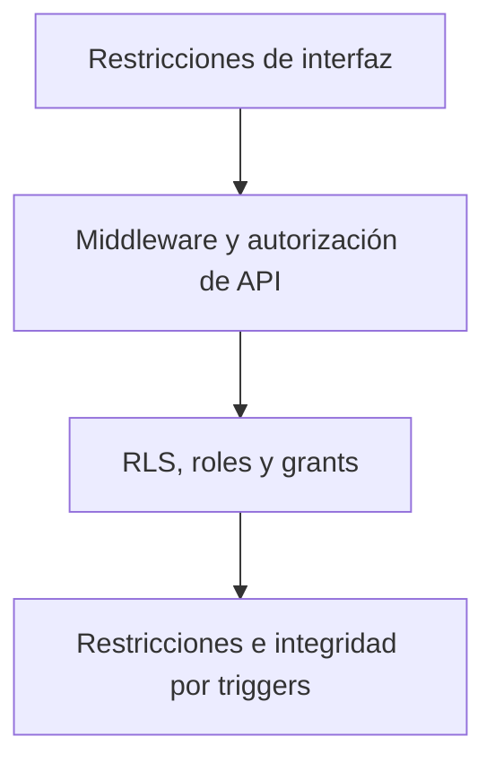

# Uso Permitido, Restricciones y Controles de Seguridad

Este documento describe el uso operativo esperado y los controles verificables del proyecto. No constituye términos legales de servicio ni una política jurídica de privacidad.

## 1. Propósito

La plataforma registra información de producción y mantenimiento que puede afectar decisiones operativas. Su uso debe conservar la identidad de quien actúa, la exactitud de los reportes, las asignaciones de máquinas y la confidencialidad de las exportaciones.

## 2. Uso esperado

- Usar una cuenta individual asignada a la persona correcta.
- Registrar únicamente máquinas autorizadas para el Operario.
- Ingresar información fiel sobre producción, tiempos y paradas.
- Finalizar o cancelar reportes mediante los flujos disponibles.
- Consultar y exportar solamente la información necesaria para funciones autorizadas.
- Mantener usuarios, roles, asignaciones y catálogos de forma responsable.

## 3. Conductas no permitidas

- Compartir credenciales o utilizar la cuenta de otra persona.
- Manipular direcciones URL o solicitudes para acceder a registros no autorizados.
- Intentar crear reportes para máquinas inactivas o no asignadas.
- Alterar marcas de tiempo, estados o duraciones por fuera de los flujos soportados.
- Intentar mantener varias paradas abiertas o intervalos superpuestos.
- Recrear una identidad retirada en vez de reactivar la existente.
- Crear variantes de nombres o códigos para evadir restricciones de duplicados.
- Distribuir archivos exportados a personas sin autorización.
- Exponer claves públicas de forma engañosa o divulgar claves privadas, tokens, contraseñas o la clave `service_role`.
- Intentar utilizar funciones administrativas sin el rol correspondiente.

## 4. Controles técnicos implementados

- **Supabase Auth:** valida las sesiones e identidades.
- **Sesiones SSR y cookies:** permiten que el servidor actúe como el usuario autenticado sin exponer una sesión administrativa al navegador.
- **Perfil activo:** el contexto de autenticación rechaza perfiles inactivos o retirados.
- **Middleware y roles:** protegen rutas y operaciones según Administrador, Operario y Consulta.
- **RLS:** limita filas visibles y modificables por la sesión actual.
- **Grants explícitos:** limitan el acceso directo a objetos; `anon` no recibe acceso general.
- **Restricciones y triggers:** protegen estados, identidad histórica, límites y reglas incluso ante solicitudes concurrentes.
- **Asignaciones:** limitan al Operario a máquinas activas asignadas.
- **Límites de borrador:** máximo cinco por Operario y uno por máquina.
- **Integridad de paradas:** una abierta por reporte, sin superposición y sin finalización mientras permanezca abierta.
- **Índices normalizados:** previenen duplicados por mayúsculas/minúsculas o espacios externos, incluyendo filas inactivas.
- **Identidad histórica:** folio y creador permanecen inmutables; retiro/reactivación conserva UUID e historia.
- **Aislamiento de `service_role`:** la clave se usa únicamente en servidor.
- **Grants estrechos de `service_role`:** acceso directo limitado a los objetos necesarios para administración de usuarios.
- **Auditoría seleccionada:** registra correcciones administrativas de reportes finalizados, eliminaciones de catálogos y retiro/reactivación de usuarios.

La interfaz mejora la experiencia, pero no es la barrera de seguridad principal. Los controles de servidor y base de datos deben mantenerse aunque un botón no sea visible.

## 5. Responsabilidades administrativas

- Asignar el rol mínimo necesario y revisar las máquinas de cada Operario.
- Retirar oportunamente identidades que ya no deben ingresar.
- Reactivar la misma identidad cuando corresponda, sin crear reemplazos.
- Revisar los datos antes de corregir reportes finalizados.
- Desactivar catálogos con historia en lugar de forzar su eliminación.
- Proteger las variables de entorno y limitar quién puede administrarlas.
- Verificar la configuración de Auth, correo y redirecciones en cada entorno Cloud.
- Definir por fuera del repositorio los procesos de monitoreo, respaldo, retención y respuesta a incidentes que la organización requiera.

## 6. Protección de exportaciones

Solo Administrador y Consulta pueden llamar a la exportación; Operario recibe una denegación incluso si intenta la URL manualmente. La consulta usa la sesión SSR normal y permanece sujeta a RLS, por lo que Consulta exporta únicamente reportes enviados. Los filtros activos se trasladan a la exportación y los límites evitan entregar silenciosamente un archivo truncado.

Los archivos pueden contener información de producción y personas responsables. Deben guardarse y compartirse únicamente en ubicaciones autorizadas. El repositorio no implementa una política organizacional de clasificación o retención de esos archivos.

## 7. Gestión de usuarios retirados

Retirar conserva UUID e historia, aplica una prohibición en Auth, marca el perfil como retirado y desactiva asignaciones. Reactivar elimina la prohibición sobre la misma identidad y exige seleccionar explícitamente las asignaciones operativas que se habilitarán; no restaura automáticamente las antiguas. Ninguno de estos flujos crea otra persona, envía una nueva invitación o restablece la contraseña.

Si una identidad retirada posee un correo, ese correo no debe reutilizarse para crear otra. La reactivación es el flujo previsto.

## 8. Limitaciones conocidas

El repositorio no establece actualmente:

- Autenticación multifactor (MFA).
- Limitación de solicitudes a nivel de aplicación.
- Monitoreo integral de seguridad o alertas operativas.
- Auditoría completa de todas las acciones, accesos, fallos o exportaciones.
- Política de retención de datos.
- Política o automatización de respaldos y recuperación ante desastres.
- Términos legales de privacidad o uso aceptable.
- Respuesta automatizada a incidentes.

Estas ausencias documentales no deben sustituirse por suposiciones sobre el proveedor de plataforma. Deben evaluarse y configurarse según el entorno y las obligaciones de la organización.
