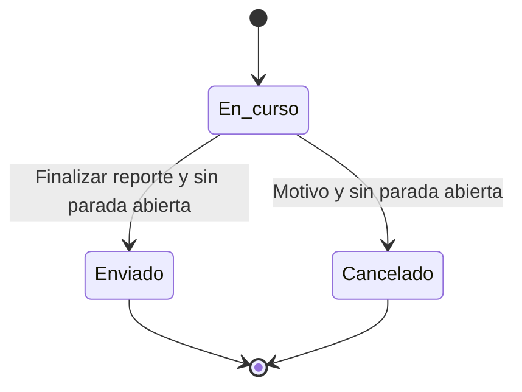

# Manual de Usuario

## Reporte Diario de Producción y Mantenimiento

## 1. Objetivo

La aplicación permite registrar, consultar y consolidar la producción diaria y las paradas de mantenimiento por máquina. Cada persona debe usar su propia cuenta y realizar únicamente las acciones disponibles para su rol.

## 2. Roles disponibles

| Rol | Uso principal |
| --- | --- |
| Administrador | Consulta todos los reportes, administra usuarios y catálogos, realiza correcciones permitidas y exporta información. |
| Operario | Crea y completa reportes de sus máquinas asignadas, registra paradas y finaliza sus borradores. |
| Consulta | Consulta reportes enviados y exporta la información que tiene autorizada. |

## 3. Iniciar sesión

1. Abra **Iniciar sesión**.
2. Ingrese su correo electrónico y contraseña.
3. Seleccione **Ingresar**.

El sistema abrirá el **Dashboard** correspondiente a su rol. Si su usuario está inactivo o retirado, no podrá acceder aunque conserve una contraseña.

## 4. Recuperar contraseña

1. En **Iniciar sesión**, seleccione **¿Olvidaste tu contraseña?**.
2. Ingrese su correo en **Recuperar contraseña**.
3. Seleccione **Enviar instrucciones**.
4. Revise su correo y abra el enlace recibido.
5. Escriba y confirme una nueva contraseña de al menos ocho caracteres.

El mensaje de la solicitud es neutral y no confirma si el correo existe.

## 5. Configurar contraseña desde una invitación

Abra el enlace de invitación enviado a su correo. Después de la verificación, la aplicación mostrará **Configurar contraseña**. Ingrese la misma contraseña en **Nueva contraseña** y **Confirmar contraseña**, con un mínimo de ocho caracteres, y seleccione **Guardar contraseña**.

El enlace puede vencer o dejar de ser válido. En ese caso, comuníquese con la persona administradora.

## 6. Panel principal

El **Dashboard** resume la actividad de hoy según el rol:

- El Administrador ve reportes en curso, enviados, cancelados y con parada activa.
- El Operario ve esos indicadores únicamente para sus propios reportes.
- Consulta ve **Reportes enviados hoy**.

La tabla de reportes recientes muestra como máximo diez registros, del más nuevo al más antiguo. Los datos disponibles siempre respetan los permisos de la cuenta.

## 7. Estados de un reporte

- **En curso:** borrador operativo que su Operario responsable todavía puede completar.
- **Enviado:** reporte finalizado para consulta. No regresa al flujo normal de edición.
- **Cancelado:** borrador cerrado con un motivo. No regresa al flujo normal de edición.

## 8. Flujo del Operario

### Máquinas y borradores

El Operario solo puede crear reportes para máquinas activas que tenga asignadas. Puede mantener un máximo de cinco reportes en curso y una máquina solo puede tener un reporte en curso a la vez.

### Crear y completar un reporte

1. En **Reportes**, seleccione la acción para crear un reporte.
2. Elija una máquina disponible y confirme la fecha operativa.
3. Complete los datos de producción que correspondan al trabajo realizado.

El reporte guarda cambios automáticamente después de una breve pausa y también permite guardar de forma manual. Antes de enviarlos al servidor, el editor de un reporte en curso propio conserva una copia de seguridad en este dispositivo. Distinga **Guardado en servidor** de **Guardado en este dispositivo** o **Cambios pendientes de sincronizar**.

Si se pierde la conexión mientras el editor ya está abierto, puede continuar completando los campos normales y usar **Guardar en este dispositivo**. Iniciar, detener, cancelar o cambiar la categoría de una parada, enviar o cancelar el reporte y guardar Cliente/Producto como valor frecuente siguen necesitando conexión. Recuperar la conexión no envía por sí solo los cambios pendientes en esta etapa: continúe editando o seleccione **Guardar ahora**.

Si cierra la aplicación, los cambios locales pueden restaurarse al volver a abrir el mismo borrador con conexión y la misma cuenta autenticada. Una recarga mientras continúa completamente offline muestra la página de contingencia; no existe un editor autenticado totalmente offline. Si el reporte cambió o fue finalizado en el servidor, la aplicación conserva los datos locales y avisa que requieren revisión, pero todavía no ofrece combinación de conflictos.

Los campos de cliente y producto permiten texto libre. Cuando corresponde, la interfaz puede ofrecer guardar ese valor como frecuente para volver a utilizarlo. Esta acción no sustituye la revisión del dato escrito.

Todos los campos de entrada del Operario son obligatorios excepto **Observaciones**. La máquina y el Operario responsable se derivan del reporte. Producto y Cliente aceptan texto libre con sugerencias; Área / Línea, Turno y Tipo de dosificador se seleccionan del catálogo. Los valores numéricos admiten cero y no admiten negativos; Unidades producidas debe ser entero.

Ingrese **Hora inicio**, **Hora finalización** y **Horas programadas** manualmente. Los campos de fecha y hora permiten indicar el día siguiente para trabajos que cruzan medianoche. **Usar hora actual** completa la fecha y hora local y permite editarlas después. Elegir un turno no cambia las horas programadas ni los horarios ingresados. Los indicadores de gestión no se muestran en la pantalla del Operario.

### Registrar una parada

1. Elija una categoría de parada.
2. Seleccione **Iniciar parada**, revise la categoría y confirme.
3. Mientras esté activa, verá el contador. Puede cambiar la categoría con confirmación; el inicio y el contador se conservan.
4. Seleccione **Detener**, revise la categoría y el tiempo transcurrido y confirme **Detener parada**. Cancelar el diálogo mantiene la parada activa.

Si inició una parada por error, use **Cancelar parada**, escriba un motivo y confirme. La parada queda marcada **Cancelada**, con su motivo, en su posición cronológica del historial. No cuenta para las estadísticas. El Operario no puede modificar, reabrir ni borrar paradas cerradas o canceladas; las correcciones posteriores corresponden al Administrador.

Solo puede existir una parada abierta por reporte. Las paradas no pueden superponerse. El tiempo se establece con el reloj del servidor. **Número de paradas** y **Tiempo total de parada** cuentan exclusivamente paradas cerradas válidas, de todas las categorías; excluyen las activas y canceladas. No se muestran totales por categoría al Operario.

### Enviar un reporte

Complete los campos obligatorios y detenga o cancele cualquier parada activa. **Enviar reporte** resalta los campos faltantes y lleva al primero. Con la información completa, revise la confirmación y seleccione **Enviar reporte**. El estado cambiará a **Enviado**. Puede seguir consultándolo, pero no editarlo, cancelarlo ni cambiar su estado.

### Cancelar un reporte

Un reporte en curso propio puede cancelarse si no tiene una parada abierta. Seleccione **Cancelar reporte**, escriba el motivo y confirme. La cancelación libera la máquina y el cupo de borrador.

## 9. Consultar reportes

La lista **Reportes de producción** muestra folio, fecha, máquina, O.P., Operario, Rol, Estado, Parada y la acción **Abrir**. La visibilidad depende del rol: el Administrador consulta todos, el Operario consulta los propios y Consulta ve los enviados.

## 10. Filtros

Puede limitar la tabla visible por:

- **Día:** una fecha exacta.
- **Semana:** desde el lunes hasta el domingo de la semana elegida.
- **Mes:** el mes calendario elegido.
- **Estado:** En curso, Enviado o Cancelado.
- **Parada activa:** reportes con una parada aún abierta.

La zona horaria operativa es `America/Bogota`. Los filtros afectan la lista mostrada y, para los roles autorizados, se conservan al usar **Exportar Excel**.

## 11. Exportación Excel

Solo **Administrador** y **Consulta** pueden exportar. Consulta continúa limitado a reportes enviados por sus permisos.

El archivo contiene:

- **SEGUIMIENTO PRODUCCIÓN:** resumen del reporte, producción y métricas.
- **DETALLE PARADAS:** una fila por evento, incluyendo el estado de las paradas abiertas sin asignarles duración.
- **CATÁLOGO PARADAS:** relación entre códigos y categorías.

Las columnas `P-1`, `P-2` y sucesivas representan el tiempo cerrado de cada categoría de parada. El formato `[h]:mm:ss` permite mostrar acumulados mayores a 24 horas. Si el volumen supera los límites admitidos, la aplicación muestra un mensaje en lugar de entregar un archivo incompleto.

## 12. Comportamiento de reportes finalizados

Los reportes **Enviados** y **Cancelados** son de consulta para el flujo normal. El Operario no puede reabrirlos ni continuar editándolos. El Administrador dispone únicamente de las correcciones que la aplicación y la base de datos permiten; estas no crean una nueva transición de estado.

## 13. Mensajes y errores frecuentes

| Mensaje o situación | Acción recomendada |
| --- | --- |
| La máquina no aparece | Confirme que esté activa y asignada, y que no tenga otro reporte en curso. |
| Se alcanzó el límite de borradores | Finalice o cancele uno de sus reportes en curso. |
| No se puede enviar o cancelar | Cierre la parada activa; para enviar, confirme además la hora de finalización. |
| El guardado no se confirma | Conserve la página abierta, revise la conexión y vuelva a guardar. |
| El enlace de invitación o recuperación es inválido | Solicite una nueva invitación o recuperación. |
| No se puede exportar | Confirme el rol, reduzca el periodo o revise el mensaje específico. |

## 14. Buenas prácticas de uso

- Use únicamente su cuenta y mantenga la contraseña privada.
- Verifique máquina, fecha y O.P. antes de registrar producción.
- Inicie y cierre las paradas cuando realmente ocurran.
- Revise las categorías y observaciones antes de finalizar.
- No cierre la página hasta confirmar que los cambios fueron guardados.
- Exporte y comparta información solo con personas autorizadas.
